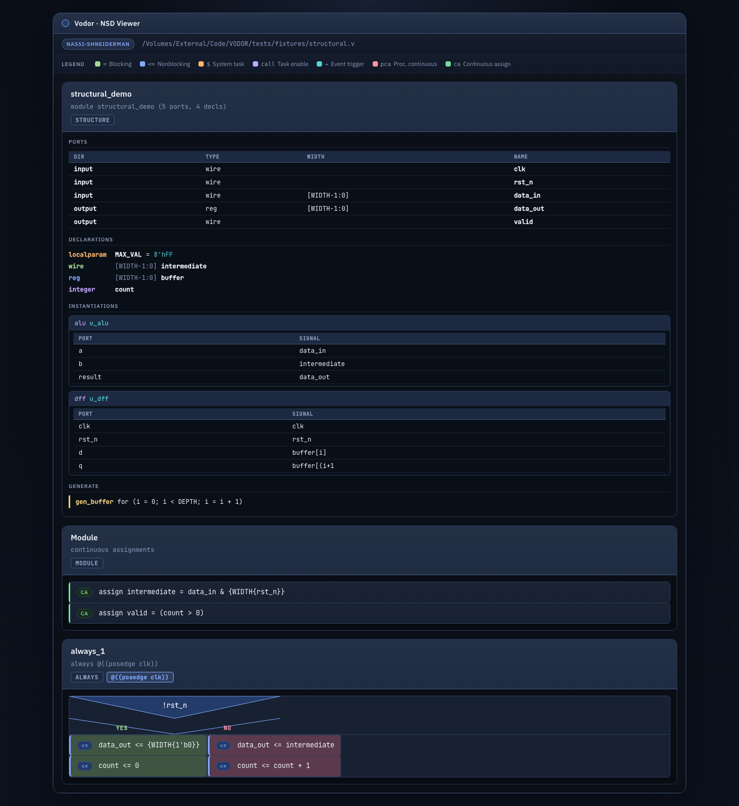
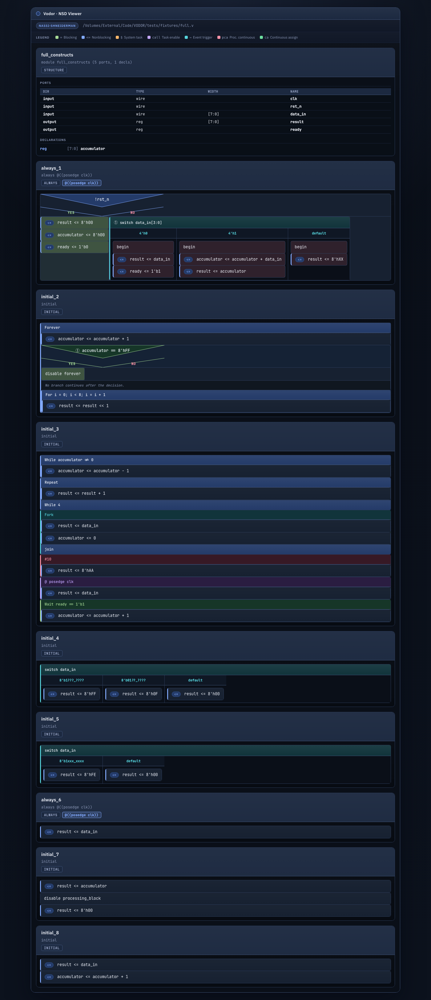
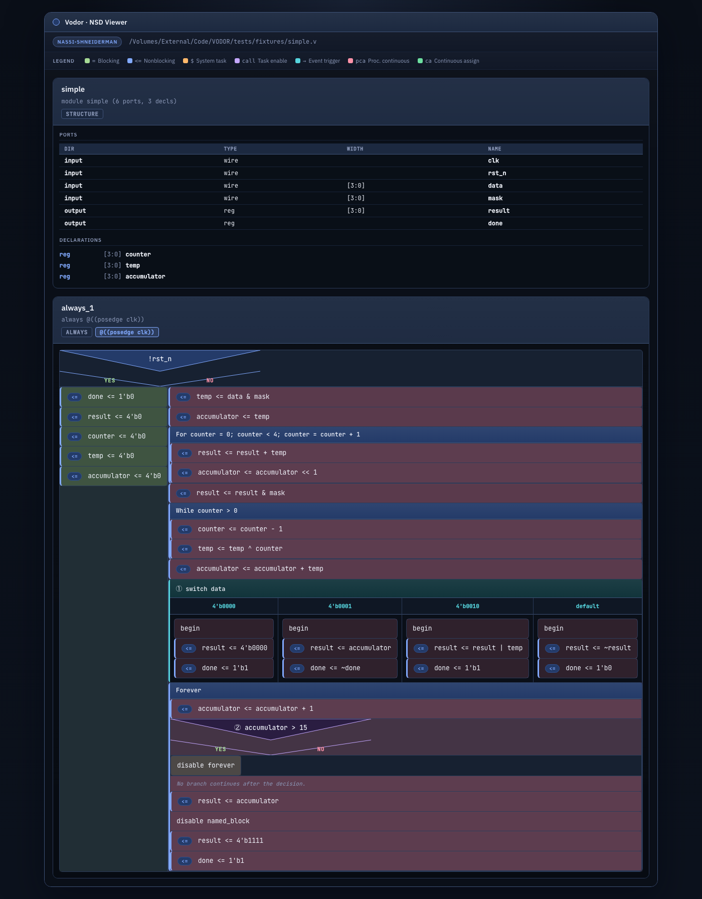
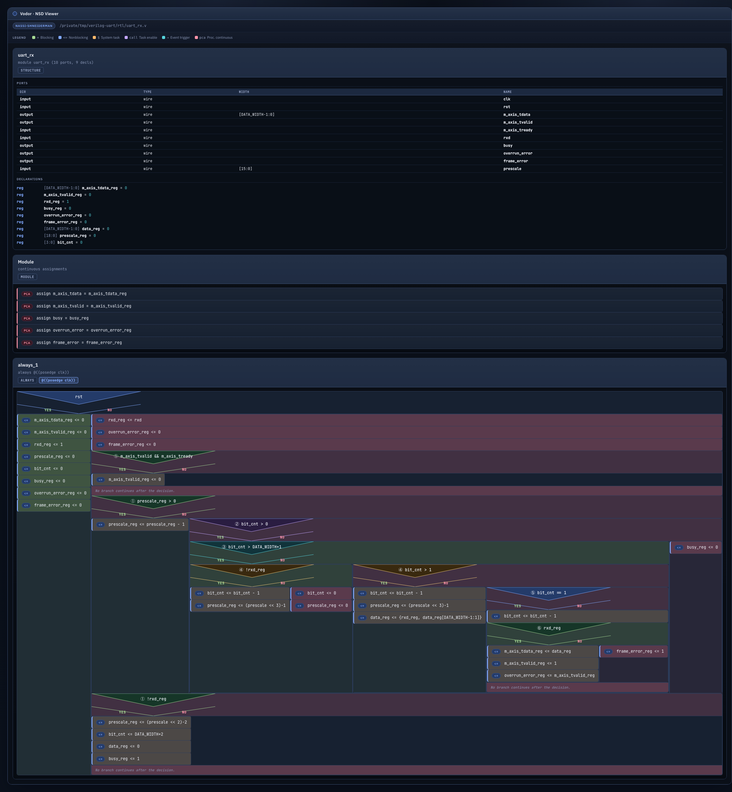
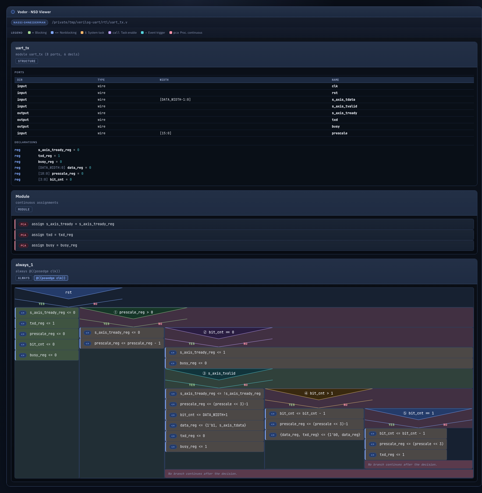
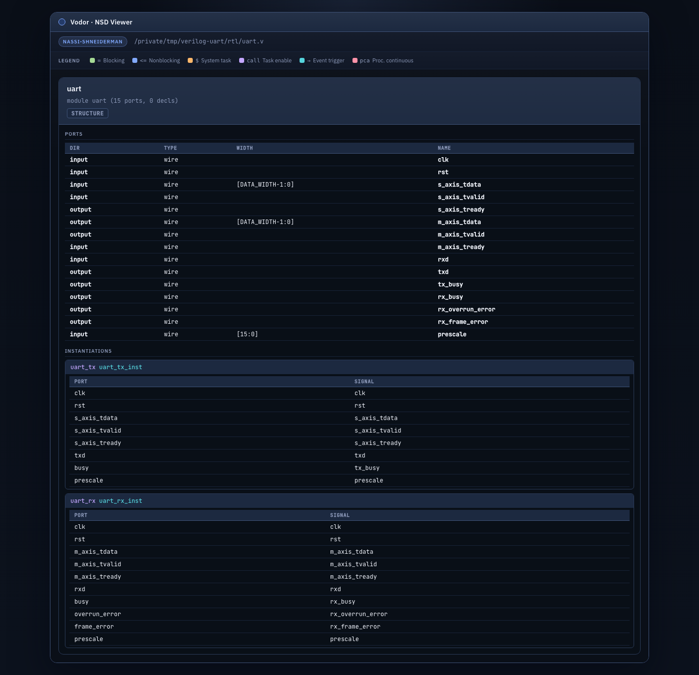
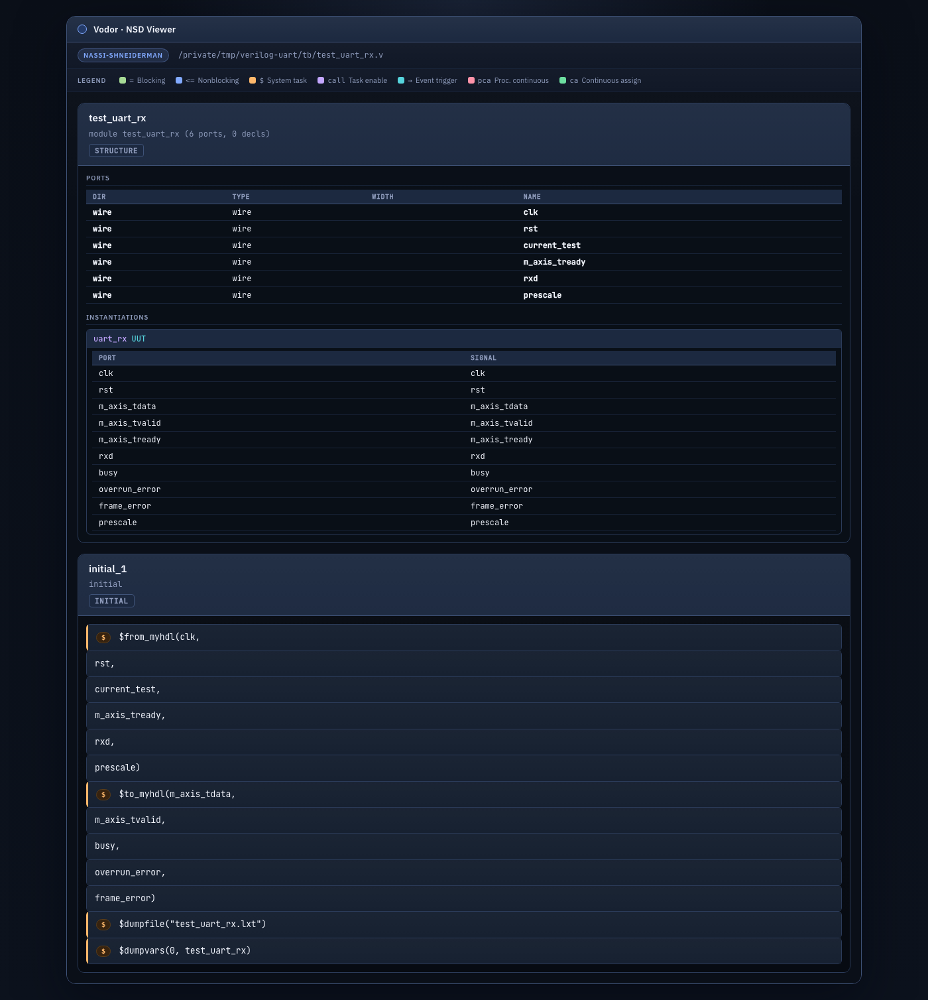

# VODOR

Verilog-Oriented Diagrammatic Output & Rendering. Parses Verilog source code and produces Nassi-Shneiderman control flow diagrams.

## What it does

* **Module structure** — Extracts module header, port list, wire/reg/parameter declarations, module instantiations, and generate blocks. Renders them as a structure panel above the procedural diagrams.
* **Parsing** — Parses Verilog files and directories via ANTLR4, extracts a structural model of modules and procedural blocks.
* **Control flow extraction** — Extracts procedural flow from `always`, `initial`, `function`, and `task` blocks, mapping constructs into structured steps: `if`/`else`, `for`, `while`, `case`/`casez`/`casex`, `forever`, `disable`, `fork`/`join`, `#delay`, `@event`, `wait`, and classified action statements.
* **Nassi-Shneiderman diagrams** — Renders control flow as standalone dark-themed HTML with classic NS diagram layout (SVG triangle caps for if/else, grid columns for switch/case, nested loops, dedicated nodes for fork/delay/event/wait). Action nodes are classified with color-coded badges: blocking/nonblocking assignments, system tasks, task calls, event triggers, and procedural continuous assignments. Function panels show sensitivity badges and block type tags.
* **Verilog export** — Re-exports behavioral Verilog from the extracted control flow model.

## Screenshots

### Structure panel + control flow



### Full construct coverage



### Simple module



### Real-world: verilog-uart (alexforencich)

Generated from [verilog-uart](https://github.com/alexforencich/verilog-uart) using `vodor nassi-dir`.

<table>
<tr>
<td><br><code>uart_rx.v</code> — receiver state machine</td>
<td><br><code>uart_tx.v</code> — transmitter state machine</td>
</tr>
<tr>
<td><br><code>uart.v</code> — structural wrapper (15 ports, 2 inst)</td>
<td><br><code>test_uart_rx.v</code> — testbench</td>
</tr>
</table>

## Architecture

DDD-inspired layered monolith with hexagonal boundaries:

* `domain` — model, invariants, ports
* `application` — use cases, DTOs
* `infrastructure` — ANTLR adapter, filesystem, rendering, regex-based control flow extractor
* `presentation` — CLI

## Quick Start

```bash
# Install
uv sync --extra dev

# Generate parser from grammar
uv run python scripts/generate_verilog_parser.py

# Parse a file
vodor parse-file path/to/module.v

# Generate Nassi-Shneiderman HTML
vodor nassi-file path/to/module.v
vodor nassi-file path/to/module.v --out output.html

# Batch diagrams for a directory
vodor nassi-dir path/to/project --out output/

# Export behavioral Verilog
vodor verilog-file path/to/module.v
vodor verilog-dir path/to/project --out output/
```

## Verilog Construct Support

### Module structure

| Construct | Extracted | Rendered | Notes |
|-----------|:---------:|:--------:|-------|
| Module header | yes | yes | Name + STRUCTURE badge panel |
| Ports (ANSI) | yes | yes | Table with Dir/Type/Width/Name, color-coded by direction |
| Ports (non-ANSI) | yes | yes | Direction + name, no type info |
| Parameterized `#(params)` | yes | yes | Parameter list skipped, port list parsed after |
| `wire` / `reg` / `integer` | yes | yes | Color-coded kind badges |
| `parameter` / `localparam` | yes | yes | With width and default value |
| Module instantiation | yes | yes | Sub-card with port connection table |
| `generate` / `endgenerate` | yes | yes | for-generate and if-generate with labels |

### Procedural constructs

How the pipeline handles each construct found inside `always`, `initial`, `function`, and `task` blocks.

#### Tier 1 — Core RTL (every design)

| Construct | Extracted | Rendered | Notes |
|-----------|:---------:|:--------:|-------|
| `if` / `else` / `else if` | yes | yes | Nested arbitrarily deep, SVG triangle caps |
| `case` / `casez` / `casex` | yes | yes | Multi-column grid, nested bodies |
| Nonblocking `<=` | yes | yes | Blue `<=` badge, left accent stripe |
| Blocking `=` | yes | yes | Green `=` badge, left accent stripe |
| `begin` / `end` | yes | yes | Flattened into parent sequence |
| Named `begin : label` | yes | yes | Recognized and flattened |

#### Tier 2 — Common patterns (most designs)

| Construct | Extracted | Rendered | Notes |
|-----------|:---------:|:--------:|-------|
| `for` loop | yes | yes | Header + body |
| `forever` loop | yes | yes | Clock generation, infinite processes |
| `disable` | yes | yes | Break out of named blocks / loops |
| `while` loop | yes | yes | Condition + body |
| `repeat` loop | yes | yes | Count + body, repeat-while footer |
| `$display`, `$monitor`, etc. | classified | yes | Orange `$` badge, system task color |
| Task / function calls | classified | yes | Purple `call` badge for bare task enables |

#### Tier 3 — Testbench constructs

| Construct | Extracted | Rendered | Notes |
|-----------|:---------:|:--------:|-------|
| `fork` / `join` / `join_any` / `join_none` | yes | yes | Fork header + join type footer |
| `#` delay control | yes | yes | Delay value + body |
| `@` event control | yes | yes | Event expression + body |
| `wait (expr)` | yes | yes | Condition + body |
| `->` event trigger | classified | yes | Teal arrow badge, event trigger color |
| `assign` / `force` / `release` / `deassign` | classified | yes | Red `pca` badge (procedural continuous) |

### Action classification

Action nodes inside diagrams are automatically classified with distinct visual treatment:

| Kind | Badge | Color | Matches |
|------|:-----:|:-----:|---------|
| Blocking assignment | `=` | Green | `result = data_in;` |
| Nonblocking assignment | `<=` | Blue | `result <= data_in;` |
| System task | `$` | Orange | `$display(...)`, `$finish`, `$monitor(...)` |
| Task call | `call` | Purple | `reset_all;`, bare task enables |
| Event trigger | `->` | Teal | `-> event_name;` |
| Procedural continuous | `pca` | Red | `assign`/`deassign`/`force`/`release` inside `always` |
| Continuous assign | `ca` | Mint | `assign`/`force`/`release` at module level |
| Other | — | Default | Everything else |

### Procedural blocks

| Construct | Handled | Notes |
|-----------|:-------:|-------|
| `always @(event)` | yes | Extracted as function panel with sensitivity badge |
| `always @*` | yes | Combinational sensitivity |
| `initial begin` | yes | Extracted as function panel |
| Single-statement `always` | yes | No `begin`/`end` wrapper required |
| `function` ... `endfunction` | yes | Name + signature from header, body extracted |
| `task` ... `endtask` | yes | Name + signature from header, body extracted |

### HTML rendering features

| Feature | Description |
|---------|-------------|
| Structure panel | Module name, ports table (color-coded by direction), declarations list, instantiation cards with connection tables, generate blocks |
| Sensitivity badge | `@(posedge clk)` shown as a colored tag in the function panel header |
| Block type tag | `ALWAYS`, `INITIAL`, `FUNCTION`, `TASK`, `STRUCTURE` badges per panel |
| SVG triangle caps | Classic NS diagram if/else with Yes/No labels |
| Grid columns | Switch/case rendered as side-by-side columns |
| Depth-coded colors | Nested if/else triangles cycle through blue/green/purple/teal/amber |
| Action badges | Color-coded badges per action kind with left accent stripe |
| Legend bar | Action kind legend between toolbar and diagram body |
| Dark theme | Editor-first dark palette with accent stripes per construct type |

### Comments

Comments (`//` line and `/* block */`) inside procedural bodies are stripped before extraction — no spurious action nodes.

### Known limitations

- **Multi-line statements** may not parse correctly — extractor works line-by-line.
- **Positional port connections** in instantiations are not parsed — only named `.port(signal)`.
- **SystemVerilog** constructs (`always_comb`, `always_ff`, `final`, `class`) are not recognized.
